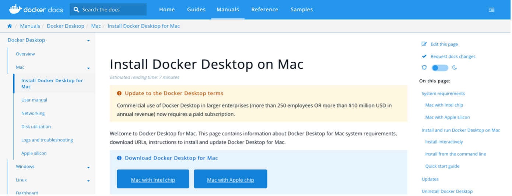

# Projet_docker_compose_MAC

## Objectif du projet

Creation une infrastructure composée de trois parties un serveur , un firewall et un client . ils sont situés dans un container Docker. nous avons utilisé Docker compose pour faciliter la communication entre les Trois. 

`apt-get update`
