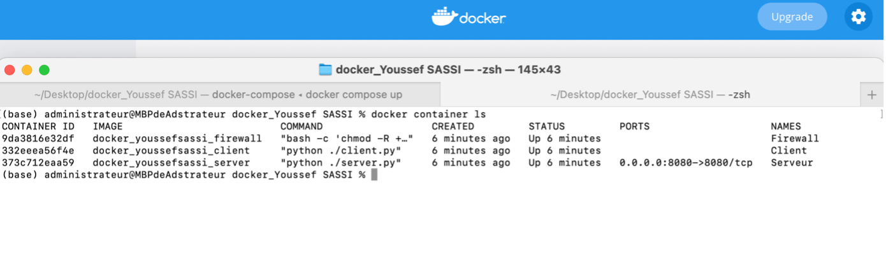

# Projet_docker_compose_MAC

## Objectif du projet

Creation une infrastructure composée de trois parties un serveur , un firewall et un client . ils sont situés dans un container Docker. nous avons utilisé Docker compose pour faciliter la communication entre les Trois. 

## Etape 1 : Installation de Docker sur MAC
A partir de site officiel , on peut telecharger docker compatible sur MAC`
Lien de téléchargement : https://docs.docker.com/desktop/mac/install/

Logiciel bien installer sur mac

## Etape 2 : Configuration de Docker sur MAC

Le projet Getting Started est un simple dépôt GitHub qui contient tout ce dont vous avez besoin pour construire une image et l'exécuter en tant que conteneur.

### Clone le référentiel en exécutant Git dans un conteneur.

### Build

Maintenant, on va construire  l'image
Une image Docker est un système de fichiers privé réservé à notre conteneur. Elle permet de fournir tous les fichiers et le code dont notre conteneur a besoin.

### execution 
On va Exécuter notre premier conteneur : nous allons Démarrer un conteneur basé sur l'image que nous avons construite à l'étape précédente. L'exécution d'un conteneur lance notre application avec des ressources privées, isolées en toute sécurité du reste de votre machine.

## Infrastructure demandée pour le projet 

### Partie client

### Partie serveur

### Partie firewall

### Un fichier docker-compose.yml 

## Contenue des fichiers utiliser pour le projet 

Partie Client
Fichier client.py

Fichier Dockerfile :

Partie serveur :
Fichier serveur.py

Fichier Dockerfile : 

Index.html : 

Partie Firewall : 

Fichier clean.sh :

Fichier firewall.sh

Dockerfile :

Fichier docker-compose.yml 

## Lancement de projet sur docker 

Il faut utiliser la commande : 
`docker-compose build `

but : creation des images à partir de fichier docker-compose.yml et dockerfile pour le client et serveur pour chaqu’un.

Avec la commade `docker images` : 
But : afficher tous les images ont été créés 

Sinon on peut trouver les images créer dans l’application docker Desktop on cliquant sur image

Avec la commade : `docker-compose up` 
But : pour lancer les contenaires client serveur , firewall

A partir de docker desktop on peut trouver les containers lancés (in use)

Avec la commande : `Docker container ls`  

But : afficher la liste de container. ( avec l’id de container ) 

Avec la commande : `docker exec -it 332eeea56f4e /bin/bash`  

### Remarque : 332eeea56f4e c’est l’id de client 
Pour acceder au client 

On a utiliser sur script client.py pour communiquer avec le serveur 

Avec la commande : `docker exec -it 9da3816e32df /bin/bash`  

### Remarque : 9da3816e32df c’est l’id de firewall 
Pour acceder au container de Firewall on utilisant l’id de firewall avec la commande iptables – L pour afficher la liste des regles.

Avec la commande `curl 172.17.0.1 :8080`  on peut lancer aussi le site web ( serveur ) 

Le firewall autorise une règle sur le port 172.18.0.1 
Et il refuse d’autre adresse ip  dans le but de filtrage des adresses ip .

